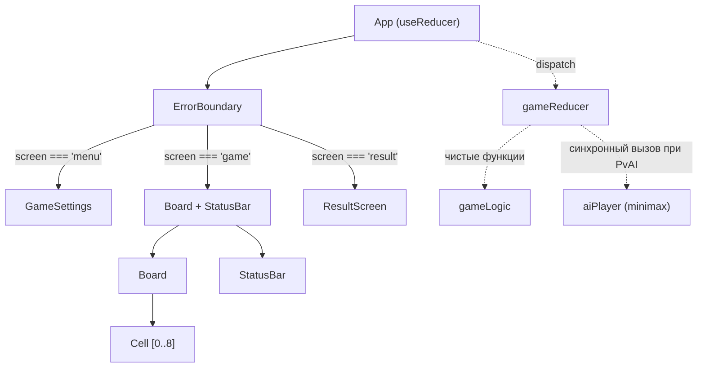
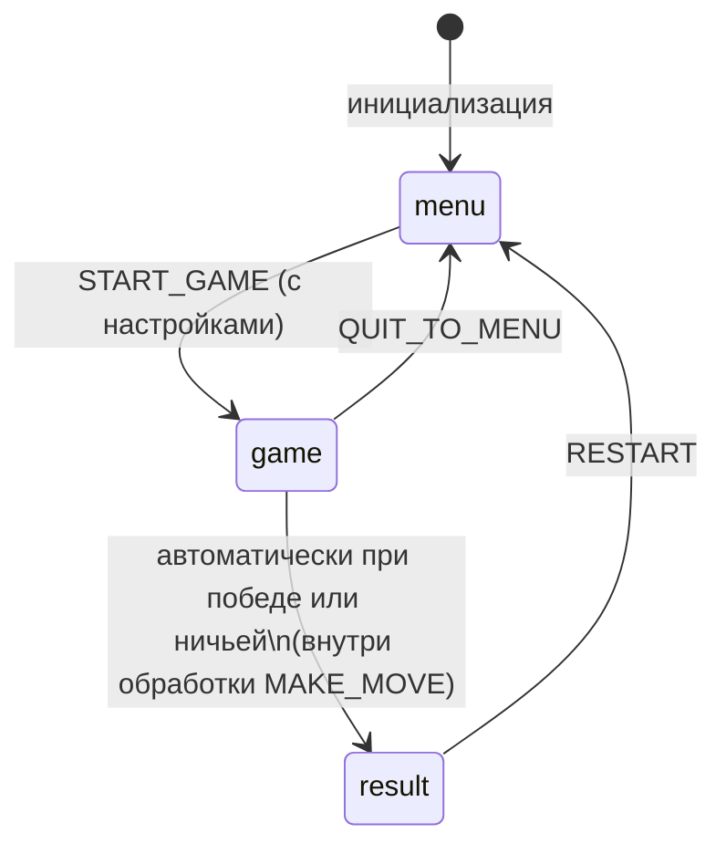
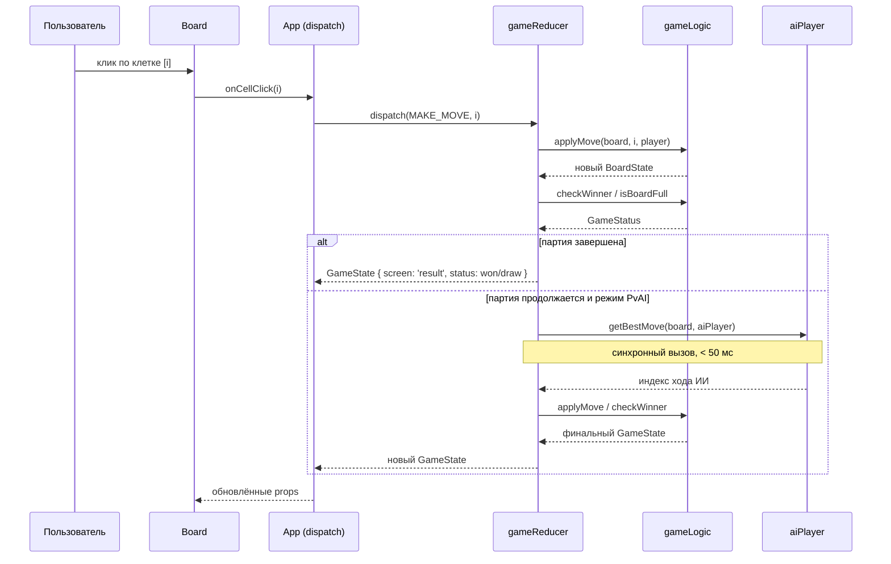
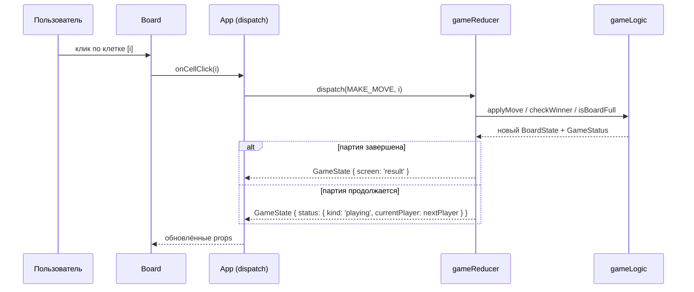

```markdown
# Архитектура: Крестики-нолики (Tic-Tac-Toe)

## Обзор

**Тип:** Single Page Application (SPA), клиентский монолит.

Всё приложение работает целиком в браузере — без серверной части, без базы
данных, без API. Сборка через Vite 5, деплой как набор статических файлов
(HTML + JS + CSS).

Ключевые принципы:
- Вся бизнес-логика изолирована в чистых функциях (`logic/`), не зависящих
  от React.
- Состояние приложения управляется через `useReducer` с явным типом действий
  `GameAction` — единственная точка мутации.
- Компоненты — чисто презентационные; они получают данные через props и
  сообщают о событиях через callback-функции.
- Ход ИИ вычисляется синхронно внутри редьюсера как часть атомарного
  обновления состояния при обработке `MAKE_MOVE`.

---

## Компоненты

| Компонент / Модуль | Ответственность |
|---|---|
| `App` | Корневой компонент; владеет `useReducer`; управляет условным рендерингом экранов (`menu → game → result`) |
| `ErrorBoundary` | Перехватывает исключения рендеринга; показывает `ErrorFallback` с кнопкой «Начать заново» |
| `Board` | Отрисовка игрового поля 3×3; делегирует клики наверх через `onCellClick` |
| `Cell` | Отдельная клетка поля; отображает `X`, `O` или пустое состояние; не хранит локального состояния; имеет `role="button"` и `aria-label` |
| `StatusBar` | Показывает текущий ход, победителя или ничью на основе `GameStatus`; использует `aria-live="polite"` |
| `GameSettings` | Выбор режима (PvP / PvAI) и стороны (X / O); вызывает `onStartGame` |
| `ResultScreen` | Экран результата: показывает победителя или ничью, кнопки «Играть снова» и «В меню» |
| `gameLogic` (модуль) | Чистые функции: `checkWinner`, `isBoardFull`, `getAvailableMoves`, `applyMove` |
| `aiPlayer` (модуль) | Ход компьютера на основе алгоритма **minimax** (детерминированный, полный перебор для поля 3×3); контракт включает поведение при граничных случаях |
| `gameReducer` (модуль) | Редьюсер: принимает `GameState` + `GameAction`, возвращает новый `GameState`; при невалидных действиях возвращает текущее состояние без изменений |
| `logger` (модуль) | Минимальный слой логирования: `logEvent(event, payload?)` — в dev пишет в консоль, в prod подключается к аналитике |
| `types` (модуль) | Общие TypeScript-типы: `Player`, `BoardState`, `GameStatus`, `AppScreen`, `GameAction`, `GameState`, `GameSettings` |

### Иерархия компонентов



---

## Машина состояний

Приложение имеет три экрана и строго определённые переходы:



Тип экрана: `AppScreen = 'menu' | 'game' | 'result'`

Недопустимые переходы (игнорируются редьюсером, возвращается текущее состояние):
- `result → game` без прохождения через `menu`
- Ход в клетку, когда `AppScreen !== 'game'`
- Ход в занятую клетку или при завершённой партии (`status.kind !== 'playing'`)
- Любое действие с невалидным индексом клетки (`index < 0 || index > 8`)

---

## Структура папок

```
src/
├── components/
│   ├── App.tsx
│   ├── App.test.tsx              # smoke-тест: начальный рендер, экран меню
│   ├── ErrorBoundary.tsx
│   ├── Board.tsx
│   ├── Board.test.tsx            # smoke-тест
│   ├── Cell.tsx
│   ├── Cell.test.tsx             # smoke-тест
│   ├── StatusBar.tsx
│   ├── StatusBar.test.tsx        # smoke-тест
│   ├── GameSettings.tsx
│   ├── GameSettings.test.tsx     # smoke-тест
│   ├── ResultScreen.tsx
│   └── ResultScreen.test.tsx     # smoke-тест
├── logic/
│   ├── gameLogic.ts
│   ├── gameLogic.test.ts         # unit-тесты (обязательно, покрытие ≥ 90%)
│   ├── gameReducer.ts
│   ├── gameReducer.test.ts       # unit-тесты (обязательно)
│   ├── aiPlayer.ts
│   └── aiPlayer.test.ts          # unit-тесты (обязательно, покрытие ≥ 90%)
├── utils/
│   └── logger.ts                 # logEvent — точка расширения для аналитики
├── types/
│   └── index.ts
├── styles/
│   ├── global.css                # сброс, шрифты, CSS-переменные (токены)
│   ├── App.module.css
│   ├── Board.module.css
│   ├── Cell.module.css
│   ├── StatusBar.module.css
│   ├── GameSettings.module.css
│   └── ResultScreen.module.css
├── main.tsx
└── vite-env.d.ts
```

**Правило размещения тестов:** тест располагается рядом с тестируемым файлом
(co-location). Единая папка `__tests__` не используется.

---

## Управление состоянием

### Стратегия: `useReducer` (обязательно)

Всё игровое состояние хранится в одном объекте `GameState` и изменяется
исключительно через `dispatch(action: GameAction)`.

```typescript
// types/index.ts

export type Player = 'X' | 'O';
export type CellValue = Player | null;
export type BoardState = [
  CellValue, CellValue, CellValue,
  CellValue, CellValue, CellValue,
  CellValue, CellValue, CellValue,
];
export type AppScreen = 'menu' | 'game' | 'result';
export type GameMode = 'pvp' | 'pvai';

export type GameStatus =
  | { kind: 'playing'; currentPlayer: Player }
  | { kind: 'won'; winner: Player; winLine: number[] }
  | { kind: 'draw' };

// Дискриминированный union: humanPlayer доступен только в режиме PvAI.
// Это исключает обращение к humanPlayer в PvP-режиме без явной проверки типа.
export type GameSettings =
  | { mode: 'pvp' }
  | { mode: 'pvai'; humanPlayer: Player };

export interface GameState {
  screen: AppScreen;
  board: BoardState;
  status: GameStatus;
  settings: GameSettings;
}

// Публичные действия, доступные компонентам.
// Переход на экран result происходит автоматически внутри редьюсера
// при обработке MAKE_MOVE — отдельного публичного действия GAME_OVER нет.
export type GameAction =
  | { type: 'START_GAME'; payload: GameSettings }
  | { type: 'MAKE_MOVE'; payload: { index: number } }
  | { type: 'RESTART' }
  | { type: 'QUIT_TO_MENU' };
```

### Начальное состояние

```typescript
// logic/gameReducer.ts

const EMPTY_BOARD: BoardState = [
  null, null, null,
  null, null, null,
  null, null, null,
];

export const INITIAL_STATE: GameState = {
  screen: 'menu',
  board: EMPTY_BOARD,
  status: { kind: 'playing', currentPlayer: 'X' },
  settings: { mode: 'pvp' },
};
```

> Поля `board` и `status` в состоянии `screen === 'menu'` содержат значения
> по умолчанию и не используются для рендеринга. Это допустимо: редьюсер
> сбрасывает их при `START_GAME`.

### Обработка ошибок в редьюсере

Редьюсер является защитным: при любом невалидном или неожиданном действии
он возвращает текущее состояние без изменений и логирует предупреждение.
Исключения внутри редьюсера не должны выбрасываться — все граничные случаи
обрабатываются явными проверками.

```typescript
// Паттерн защитного редьюсера
export function gameReducer(state: GameState, action: GameAction): GameState {
  try {
    // ... логика обработки действий
  } catch (error) {
    logEvent('reducer_error', { action, error });
    return state; // возврат текущего состояния при непредвиденной ошибке
  }
}
```

**Обоснование выбора `useReducer`:** состояние содержит несколько взаимосвязанных
полей (поле, статус, экран, настройки), которые должны обновляться атомарно.
`useState` для каждого поля создаёт риск рассинхронизации между рендерами.
`useReducer` гарантирует единственную точку мутации и упрощает тестирование
редьюсера как чистой функции.

---

## Алгоритм ИИ

**Зафиксированный алгоритм: minimax (полный перебор, без оптимизаций)**

Обоснование:
- Поле 3×3 имеет не более 9! = 362 880 листовых узлов — тривиально для
  синхронного вычисления в браузере (измеренное время < 5 мс).
- Алгоритм детерминирован: при одинаковом состоянии поля всегда возвращает
  один и тот же ход. Это критично для тестируемости.
- Alpha-beta pruning не требуется при данном размере поля.
- Синхронный вызов внутри редьюсера гарантирует атомарность обновления
  состояния (ход игрока + ответный ход ИИ — одна транзакция).

**Контракт функции:**

```typescript
// logic/aiPlayer.ts

/**
 * Возвращает индекс оптимального хода для aiPlayer на основе minimax.
 *
 * Граничные случаи:
 * - Если доска полностью заполнена — выбрасывает Error('No available moves').
 *   Вызывающий код (gameReducer) обязан проверить isBoardFull перед вызовом.
 * - Если победитель уже определён — поведение не определено;
 *   вызывающий код обязан проверить статус игры перед вызовом.
 *
 * @param board   Текущее состояние доски
 * @param aiPlayer Символ ИИ ('X' или 'O')
 * @returns Индекс клетки [0..8]
 */
export function getBestMove(
  board: BoardState,
  aiPlayer: Player,
): number;
```

**Performance-контракт:** `getBestMove` должна выполняться менее чем за 50 мс
на любом валидном состоянии доски. Проверяется автоматическим тестом:

```typescript
// aiPlayer.test.ts — обязательный тест производительности
it('выполняется менее чем за 50 мс на пустой доске (худший случай)', () => {
  const start = performance.now();
  getBestMove(EMPTY_BOARD, 'X');
  expect(performance.now() - start).toBeLessThan(50);
});
```

---

## Стилизация

**Единственный подход: CSS Modules** (файлы `*.module.css`).

Правила:
- Каждый компонент имеет собственный CSS-модуль с одноимённым файлом.
- Глобальные стили (сброс, шрифты, CSS-переменные) — только в
  `src/styles/global.css`, подключаемом в `main.tsx`.
- Смешение CSS Modules с inline-стилями или styled-components запрещено.
- Inline-стили (`style={...}`) допустимы исключительно для динамических
  значений, невыразимых через CSS-переменные. Каждое исключение
  документируется комментарием `// STYLE_EXCEPTION: <обоснование>`.

### Токены дизайна (CSS-переменные в `global.css`)

```css
:root {
  /* Цвета игроков */
  --color-player-x: #e74c3c;
  --color-player-o: #3498db;

  /* Цвета интерфейса */
  --color-bg: #f9f9f9;
  --color-surface: #ffffff;
  --color-border: #cccccc;
  --color-text-primary: #222222;
  --color-text-secondary: #666666;
  --color-accent: #27ae60;

  /* Размеры клетки */
  --cell-size-mobile: 80px;
  --cell-size-desktop: 120px;

  /* Типографика */
  --font-family: 'Segoe UI', system-ui, sans-serif;
  --font-size-base: 16px;
  --font-size-large: 24px;
}
```

**Адаптивная вёрстка:**
- Поле `Board` использует CSS Grid (`grid-template-columns: repeat(3, 1fr)`).
- Минимальный размер клетки: `var(--cell-size-mobile)` на мобильных,
  `var(--cell-size-desktop)` на десктопе.
- Breakpoint: `@media (max-width: 480px)` — уменьшение шрифтов и отступов.
- Приложение корректно отображается при ширине экрана от `320px`.

---

## Доступность (Accessibility)

Минимальные требования a11y, обязательные для всех интерактивных элементов:

| Элемент | Требование |
|---|---|
| `Cell` | `role="button"`, `aria-label="Клетка {row}×{col}, {значение или пусто}"`, `tabIndex={0}`, обработка `onKeyDown` (Enter / Space) |
| `StatusBar` | `aria-live="polite"` — объявляет изменение статуса игры для скринридеров |
| `Board` | `role="grid"`, `aria-label="Игровое поле"` |
| Кнопки `ResultScreen` | Стандартный `<button>` с понятным текстом (не только иконки) |
| `GameSettings` | Все `<input>` и `<select>` имеют явные `<label>` |

---

## Обработка ошибок

**Два уровня обработки ошибок:**

### Уровень 1: Ошибки рендеринга — `ErrorBoundary`

`ErrorBoundary` оборачивает всё дерево ниже `App`:

```tsx
<ErrorBoundary fallback={<ErrorFallback onReset={handleReset} />}>
  {/* текущий экран */}
</ErrorBoundary>
```

- При исключении в любом дочернем компоненте показывается `ErrorFallback`
  с сообщением и кнопкой «Начать заново».
- Кнопка вызывает `dispatch({ type: 'RESTART' })` и сбрасывает границу ошибки.
- Ошибка логируется через `logEvent('render_error', error)`.

### Уровень 2: Ошибки в бизнес-логике — защитный редьюсер

`ErrorBoundary` **не перехватывает** ошибки в обработчиках событий и
синхронном коде редьюсера. Поэтому:

- `gameReducer` оборачивает всю логику в `try/catch` и при исключении
  возвращает текущее состояние (см. раздел «Управление состоянием»).
- Все чистые функции в `logic/` обязаны явно обрабатывать граничные случаи
  (пустой массив ходов, заполненная доска) без выброса исключений там,
  где это возможно.
- `getBestMove` выбрасывает `Error` только при вызове с полной доской —
  это программная ошибка, которую редьюсер должен предотвратить проверкой.

---

## Хранение данных

- **Runtime state:** `useReducer` в компоненте `App`. Хранит `GameState`.
- **Персистентность:** не требуется. Каждая партия живёт в памяти; при
  перезагрузке страницы состояние сбрасывается.
- **Кэширование:** не применимо — нет сетевых запросов.

---

## Коммуникация

- **Внешние вызовы:** отсутствуют. Приложение полностью офлайн после загрузки.
- **Внутренняя коммуникация:** однонаправленный поток данных.
  - Данные передаются вниз через `props`.
  - События передаются вверх через callback-функции (`onCellClick`,
    `onStartGame`, `onRestart`, `onQuitToMenu`).
  - Все мутации состояния — только через `dispatch`.
  - Context не используется (дерево компонентов достаточно мелкое).

### Поток данных одного хода (PvAI)



### Поток данных одного хода (PvP)



---

## Инфраструктура

| Аспект | Решение |
|---|---|
| Сборка | Vite 5 (`vite build` → `dist/`), бандл ≤ 100 КБ gzip |
| Деплой | Статический хостинг: GitHub Pages или Vercel (бесплатный tier) |
| CI/CD | GitHub Actions: lint → test (с coverage) → build → deploy |
| Мониторинг | `logEvent` в `ErrorBoundary` и редьюсере; опционально — Vercel Analytics |

### CI-пайплайн (`.github/workflows/ci.yml`)

```
push / PR →
  install deps (npm ci) →
  eslint (flat config) →
  prettier --check →
  vitest --coverage (порог 60% общий, 90% для logic/) →
  vite build --report (проверка размера бандла) →
  deploy (только ветка main)
```

---

## Тестирование

| Файл | Тип | Что проверяется |
|---|---|---|
| `gameLogic.test.ts` | unit | `checkWinner` (все 8 линий + ничья + незавершённая игра), `isBoardFull`, `getAvailableMoves` (включая пустую и полную доску), `applyMove` |
| `aiPlayer.test.ts` | unit | Детерминированность хода, блокировка победы противника, выбор победного хода, производительность (< 50 мс), поведение при полной доске (ожидаемое исключение) |
| `gameReducer.test.ts` | unit | Все переходы `GameAction`, недопустимые ходы игнорируются, автоматический переход на `result` при победе/ничьей, защитное поведение при невалидных действиях |
| `Board.test.tsx` | smoke | Рендер 9 клеток, вызов `onCellClick` |
| `Cell.test.tsx` | smoke | Рендер X / O / пустой клетки, наличие `role="button"` и `aria-label` |
| `StatusBar.test.tsx` | smoke | Отображение статуса для каждого `GameStatus.kind`, наличие `aria-live` |
| `GameSettings.test.tsx` | smoke | Рендер формы, вызов `onStartGame` |
| `ResultScreen.test.tsx` | smoke | Рендер победителя / ничьей, вызов `onRestart` и `onQuitToMenu` |
| `App.test.tsx` | smoke | Рендер без падений, начальный экран — меню (без взаимодействия) |

**Минимальное покрытие:** 60% (строки) — общее. Модули `gameLogic` и
`aiPlayer` должны иметь покрытие ≥ 90% как критическая бизнес-логика.

**Примечание по `App.test.tsx`:** smoke-тест проверяет только начальный
рендер (экран меню) без взаимодействия. Интеграционные сценарии (полная
игра от начала до конца) покрываются тестами `gameReducer.test.ts`.

---

## Безопасность

- **Authentication / Authorization:** не требуется — однопользовательское
  приложение без серверной части.
- **Валидация ходов** (в `gameReducer`):
  - индекс клетки валиден (`index >= 0 && index <= 8`);
  - клетка не занята (`board[index] === null`);
  - партия не завершена (`status.kind === 'playing'`);
  - текущий экран — `'game'`.
- **XSS:** React экранирует вывод по умолчанию; `dangerouslySetInnerHTML`
  не используется и запрещён.
- **Secrets:** отсутствуют.

---

## Архитектурные инварианты

Следующие правила **обязательны** на всём протяжении реализации и не могут
быть нарушены без создания нового ADR.

### Инварианты потока данных

1. **Единственная точка мутации состояния.**
   Состояние `GameState` изменяется исключительно через
   `dispatch(action: GameAction)`. Прямое изменение объекта состояния
   (мутация) запрещено.

2. **Однонаправленный поток данных.**
   Данные движутся только вниз (props), события — только вверх (callbacks).
   Компоненты не обращаются к состоянию соседних компонентов напрямую.

3. **Изоляция бизнес-логики.**
   Функции в `logic/` не импортируют ничего из `components/` и не используют
   React API. Они являются чистыми функциями: `(input) => output`, без
   побочных эффектов.

4. **ИИ вызывается только из `gameReducer`.**
   `aiPlayer.getBestMove` не вызывается напрямую из компонентов. Это
   гарантирует, что ход ИИ всегда является частью атомарного обновления
   состояния.

5. **Переход на экран `result` происходит только внутри редьюсера.**
   Компоненты не диспатчат действие, переводящее игру в состояние результата.
   Переход инициируется автоматически при обработке `MAKE_MOVE`, когда
   `checkWinner` или `isBoardFull` возвращают соответствующий результат.

6. **Редьюсер не выбрасывает исключения.**
   При любом невалидном или неожиданном входе редьюсер возвращает текущее
   состояние и логирует предупреждение через `logEvent`. Исключения
   перехватываются внутренним `try/catch`.

### Инварианты производительности

7. **Ход ИИ вычисляется синхронно за < 50 мс.**
   Для поля 3×3 minimax завершается мгновенно. Проверяется автоматическим
   тестом в `aiPlayer.test.ts`. Если в будущем поле увеличится, вычисление
   должно быть вынесено в Web Worker до слияния (ADR обязателен).

8. **Первый рендер приложения — < 1 с на соединении 3G.**
   Бандл не должен превышать 100 КБ (gzip). Проверяется через
   `vite build --report` в CI.

### Инварианты безопасности

9. **`dangerouslySetInnerHTML` запрещён** в любом компоненте без исключений.

10. **Все пользовательские действия валидируются в `gameReducer`** до
    применения к состоянию. Компоненты не выполняют валидацию самостоятельно
    (они доверяют редьюсеру).

### Инварианты согласованности типов

11. **Экран `result` достижим только из состояния `game`.**
    Переход `menu → result` напрямую недопустим и должен игнорироваться
    редьюсером.

12. **Тип `BoardState` — кортеж фиксированной длины 9.**
    Нигде в коде не используется `Array<CellValue>` вместо `BoardState`.
    Это обеспечивает статическую проверку индексов на уровне TypeScript.

13. **`GameSettings` — дискриминированный union.**
    Поле `humanPlayer` доступно только при `mode === 'pvai'`. Обращение к
    `humanPlayer` без проверки `mode` является ошибкой компиляции.

14. **CSS Modules — единственный механизм стилизации компонентов.**
    Inline-стили (`style={...}`) допустимы только для динамических значений,
    которые невозможно выразить через CSS-переменные (например, анимация
    с вычисляемым значением). Каждое такое исключение документируется
    комментарием `// STYLE_EXCEPTION: <обоснование>`.

15. **Все токены дизайна определяются как CSS-переменные в `global.css`.**
    Хардкод цветов, размеров и шрифтов непосредственно в `*.module.css`
    запрещён — используются только переменные из `:root`.

---

## Известные компромиссы

| Что упрощено | Почему | Последствия |
|---|---|---|
| Нет серверной части | Учебный проект, бюджет $0 | Невозможен мультиплеер по сети |
| Нет персистентности | Не нужна для одной партии | История игр не сохраняется между сессиями |
| Покрытие тестами 60% (общее) | Учебный проект | Меньше гарантий при рефакторинге; критическая логика покрыта на 90%+ |
| Minimax без alpha-beta pruning | Поле 3×3 — пространство поиска тривиально | Не масштабируется на бо́льшие поля без доработки |
| Нет i18n | Один язык интерфейса достаточен | При локализации потребуется рефакторинг строк |
| Нет Web Worker для ИИ | Вычисление тривиально по времени (< 5 мс) | При увеличении поля потребуется вынос в Worker |
| Context не используется | Дерево компонентов мелкое | При росте дерева потребуется добавить Context или внешний стор |
| Минимальная observability | Учебный проект, нет бюджета на APM | Отладка в продакшне затруднена; `logEvent` создаёт точку расширения |
| Нет полных интеграционных тестов | Покрывается unit-тестами редьюсера | Сквозные сценарии (UI → логика → UI) не автоматизированы |

---

## ADR (Architecture Decision Records)

| № | Название | Статус |
|---|---|---|
| ADR-001 | `useReducer` как единственный механизм управления игровым состоянием | Принято |
| ADR-002 | Minimax (полный перебор) как алгоритм ИИ для поля 3×3 | Принято |
| ADR-003 | Co-location тестов (тест рядом с тестируемым файлом) | Принято |
| ADR-004 | CSS Modules как единственный подход к стилизации компонентов | Принято |
| ADR-005 | ErrorBoundary как единственный механизм обработки ошибок рендеринга | Принято |
| ADR-006 | Синхронный вызов ИИ внутри редьюсера (vs. асинхронный через `useEffect`) | Принято |
| ADR-007 | Дискриминированный union для `GameSettings` вместо опционального поля | Принято |
| ADR-008 | Защитный редьюсер с `try/catch` как стратегия обработки ошибок в логике | Принято |
| ADR-009 | Минимальные требования accessibility (a11y) для игровых элементов | Принято |
```